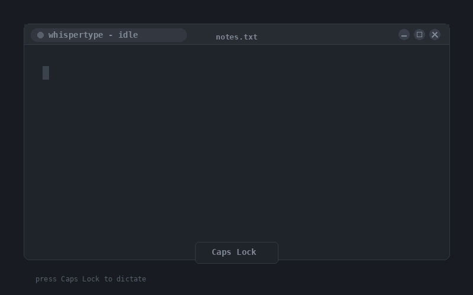

# whispertype

Push-to-talk dictation for Linux Wayland: press Caps Lock, speak, press Caps Lock again — transcribed text appears in the focused window.



## Why this exists

- **Offline.** Nothing leaves your machine. Transcription runs locally via `whisper.cpp`.
- **Fast.** CUDA-accelerated when an NVIDIA GPU is present. A 5-second clip transcribes in well under a second on consumer hardware.
- **Accurate.** Uses OpenAI's `large-v3` Whisper model.
- **Wayland-native.** Most existing dictation tools assume X11 (xdotool) or a Wayland protocol GNOME doesn't expose (wtype). whispertype uses `ydotool`, which injects at the kernel `/dev/uinput` layer and works under any compositor.

## Compared with alternatives

| Tool | Engine | Mode | Notes |
|------|--------|------|-------|
| **whispertype** | whisper.cpp (large-v3) | Push-to-talk | Lightweight, Wayland-native, offline, CUDA-aware. |
| nerd-dictation | Vosk | Streaming | Lower accuracy than Whisper; X11 focus. |
| Buzz | OpenAI Whisper | GUI / file-based | Records files for transcription, not real-time typing. |
| whisper.cpp `examples/stream` | whisper.cpp | Continuous streaming | Always-on streaming, not press-to-record. |

whispertype is positioned as a lightweight push-to-talk option for Wayland desktops, whisper-powered.

## Quickstart

```bash
curl -fsSL https://raw.githubusercontent.com/kungla/whispertype/main/install.sh | bash
```

The installer:

1. Installs system packages (apt is automated; dnf/pacman print the package list for now).
2. Clones `whisper.cpp` into `~/.local/share/whispertype/whisper.cpp`.
3. Builds it. With CUDA if `nvcc` is found, else CPU+BLAS. **CUDA builds are capped at `-j2`** because `nvcc` + ggml-cuda template translation units each peak at several GB of RAM; a full `-j$(nproc)` build will OOM on most consumer machines. Don't loosen this without thinking.
4. Downloads the `ggml-large-v3` model (~3 GB).
5. Installs `~/.local/bin/whispertype`.
6. Installs and enables a user systemd unit for `ydotoold`.
7. **Merges** `caps:menu` into your existing `org.gnome.desktop.input-sources xkb-options` (does not clobber other options).
8. Registers a GNOME custom shortcut: `Menu` keysym -> `whispertype`.

Re-running the installer is safe. Every step checks current state first.

You may need to log out and back in once for the xkb option to take effect.

## Usage

1. Focus any text field (editor, browser address bar, terminal, chat box).
2. Press **Caps Lock**. A short bell plays — recording.
3. Speak.
4. Press **Caps Lock** again. A different bell plays — transcribing.
5. The transcribed text appears in the focused field, with a trailing space.

That's the whole interface.

## Configuration

| Knob | Default | Notes |
|------|---------|-------|
| Model file | `~/.local/share/whispertype/whisper.cpp/models/ggml-large-v3.bin` | Override with `WHISPERTYPE_MODEL=/path/to/other.bin`. Download other sizes with `bash ~/.local/share/whispertype/whisper.cpp/models/download-ggml-model.sh <size>` (e.g. `base.en`, `small`, `medium`). |
| Whisper binary | `~/.local/share/whispertype/whisper.cpp/build/bin/whisper-cli` | Override with `WHISPERTYPE_BIN=...`. |
| Language | `en` | Override with `WHISPERTYPE_LANG=de` (or any whisper-supported code). |
| Toggle script | `~/.local/bin/whispertype` | Edit this file to tweak whisper flags, filters, or beep cues. |
| Keybinding | Caps Lock | Change via GNOME Settings -> Keyboard -> Custom Shortcuts -> "whispertype". |
| Log | `$XDG_RUNTIME_DIR/whispertype/log` | One file, appended on every invocation. |

## Troubleshooting

### "Subtitles by the Amara.org community" gets typed

Your mic is clipping. Whisper hallucinates that exact phrase on garbled or silent input — it was trained on YouTube subtitle data and "Subtitles by the Amara.org community" appears thousands of times in the training set.

The toggle script already filters this phrase out (you should never see it actually typed), but the underlying problem is your input level. Fix it at the ALSA layer, not in PipeWire — PipeWire's volume sits on top of the ALSA gain.

```bash
arecord -l                          # find your card number
amixer -c <card> sget Capture       # check current Capture level
amixer -c <card> sget 'Mic Boost'   # check current boost
```

If Capture shows `[100%]` or `+30 dB`, lower it:

```bash
amixer -c <card> cset numid=21 23   # Capture L  (~0 dB on a 0-63 raw scale)
amixer -c <card> cset numid=23 23   # Capture R
amixer -c <card> cset numid=26 0    # Front Mic Boost OFF
```

(numids vary by card. Run `amixer -c <card> controls` to find yours.)

Also check that both `Input Source` selectors point at the **same** mic:

```bash
amixer -c <card> cget numid=19
amixer -c <card> cget numid=20
```

If one says "Front Mic" and the other says "Rear Mic", your two ADC channels are recording from different physical jacks — they'll fight each other.

Also verify both **Capture Switches** are on (one per ADC channel):

```bash
amixer -c <card> cget numid=22
amixer -c <card> cget numid=24
```

If either is `values=off,off`, turn it on:

```bash
amixer -c <card> cset numid=24 on
```

A muted second channel halves the mono-mixed amplitude.

### Dictation is much quieter than expected, even after fixing ALSA

PipeWire has its **own** volume on top of ALSA. Run:

```bash
wpctl get-volume @DEFAULT_AUDIO_SOURCE@
```

If it reports something like `Volume: 0.10` (10%), bump it:

```bash
wpctl set-volume @DEFAULT_AUDIO_SOURCE@ 0.75
```

You can also drag the input slider in **GNOME Settings → Sound → Input** — same control. This is independent of the ALSA gain settings above.

### Caps Lock does nothing

The xkb option may not have applied to your live session yet. Log out and back in. Then verify:

```bash
gsettings get org.gnome.desktop.input-sources xkb-options
```

The output should include `'caps:menu'`. If it doesn't, run the installer again — it's idempotent.

### No transcription appears

Check the log:

```bash
tail "$XDG_RUNTIME_DIR/whispertype/log"
```

You'll see lines like `raw: [...]` and `filtered: [...]`. If `raw` is a hallucination phrase ("Subtitles by Amara.org", "Thank you.", a lone "you") and `filtered` is empty, that's the silence-hallucination filter doing its job — and your real problem is the clipping fix above.

If `raw` itself is empty, the whisper binary didn't produce output. Check that `~/.local/share/whispertype/whisper.cpp/build/bin/whisper-cli` exists and the model file is present and not zero-byte.

### Transcription works but no text gets typed

Check the input-injection daemon:

```bash
systemctl --user status whispertype-ydotoold.service
ls -la "$XDG_RUNTIME_DIR/.ydotool_socket"
```

If the service is in `failed` state, restart it:

```bash
systemctl --user restart whispertype-ydotoold.service
```

If it keeps dying with `code=exited, status=2`, a stale socket file may be blocking startup. The unit file has an `ExecStartPre` that removes stale sockets, but if you upgraded from an older version it may not be in place — re-run the installer to refresh the unit.

## How it works

Two layers:

```
Audio path:
  Caps Lock 1st press   arecord                   /run/user/.../whispertype/clip.wav
       v                   v                                 |
       |                   |                                 v
       +---> whispertype --+              whisper-cli --m ggml-large-v3.bin
                |                                            |
  Caps Lock 2nd press                                        v
                                          ydotool type "<text> "  ->  focused window
```

```
Keybind path:
  Caps Lock key  ->  xkb caps:menu  ->  Menu keysym  ->  GNOME custom shortcut  ->  ~/.local/bin/whispertype
```

The script is a toggle. State (recording vs. idle) is just "is there a live `arecord` PID file in `$XDG_RUNTIME_DIR/whispertype`?" — no daemon, no IPC.

## Uninstall

```bash
git clone https://github.com/kungla/whispertype
cd whispertype
./uninstall.sh
```

The uninstaller removes the script, the systemd unit, the GNOME custom shortcut, and `caps:menu` from xkb-options (preserving any other options you had). It leaves `~/.local/share/whispertype/` alone — that directory holds the ~3 GB model and the whisper.cpp build, and you may want to keep them. Remove manually if not:

```bash
rm -rf ~/.local/share/whispertype
```

## Roadmap (v1.1+)

- System tray indicator showing recording state.
- Snap and Flatpak packaging.
- VAD-based auto-stop (release Caps Lock once you stop talking).
- Multi-language switching without restarting.
- Smaller-model presets for low-RAM machines.
- "Hold-to-talk" mode in addition to toggle.

## Acknowledgments

- [whisper.cpp](https://github.com/ggerganov/whisper.cpp) by Georgi Gerganov and contributors.
- The [Whisper](https://github.com/openai/whisper) models by OpenAI.
- [ydotool](https://github.com/ReimuNotMoe/ydotool) by ReimuNotMoe.

## License

MIT. See [LICENSE](LICENSE).
